# Proyecto Instituto – Spring Boot

## Ejercicio 1: Configuración de Pebble como motor de plantillas

El proyecto se ha configurado para utilizar **Pebble** como motor de plantillas en Spring Boot.

Las vistas se almacenan en el directorio `resources/templates` y utilizan la extensión `.peb.html`.  
Spring Boot integra Pebble automáticamente mediante su dependencia, permitiendo renderizar vistas dinámicas desde los controladores.

Se ha comprobado el correcto funcionamiento devolviendo una vista Pebble desde un controlador web, la cual se renderiza correctamente en el navegador.

### Captura de funcionamiento

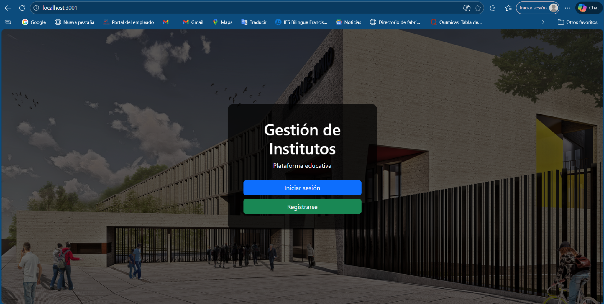

### Ejercicio 2:Uso de macros en Pebble

En el proyecto se han definido macros para crear componentes reutilizables, como botones, los cuales se importan y utilizan desde las vistas.

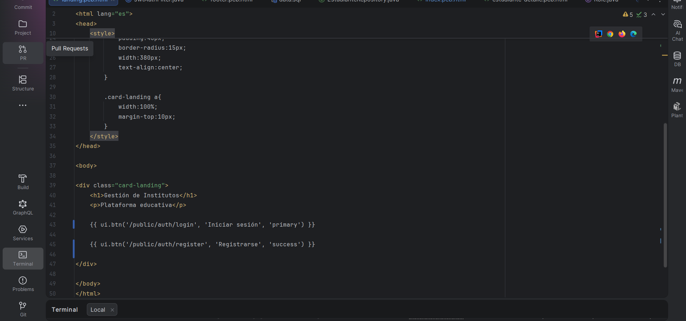

### Importación de macros en Pebble

Las macros se importan desde las vistas utilizando la directiva `import` de Pebble, lo que permite reutilizar componentes definidos de forma centralizada.

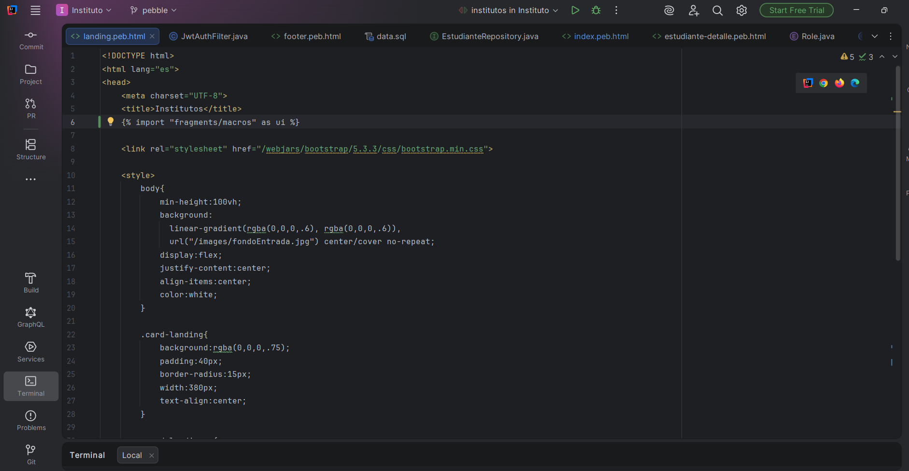

## Ejercicio 3: Configuración de seguridad en las vistas según el perfil del usuario

En este ejercicio se ha configurado la seguridad en las vistas utilizando **Pebble**, de modo que determinadas partes de la interfaz se muestran u ocultan en función del **perfil del usuario autenticado**.

Para ello, se utilizan condiciones en las plantillas Pebble basadas en los roles gestionados por **Spring Security**, permitiendo adaptar dinámicamente la interfaz según los permisos del usuario.

---

### Control de visibilidad según rol

En las vistas se emplea la función `request.isUserInRole(...)` para comprobar el rol del usuario autenticado y decidir qué elementos deben mostrarse.

Ejemplo utilizado en las plantillas:

```html

    <!-- Acciones solo visibles para administradores -->

````

### Captura 1: Usuario con rol USER

En esta captura se muestra la vista principal accediendo con un usuario que tiene el rol USER.

Características visibles:

No aparecen los botones Crear, Editar ni Eliminar.

Únicamente se muestra la acción Ver, permitiendo solo la consulta de datos.

Se demuestra que las acciones administrativas están ocultas para este perfil.

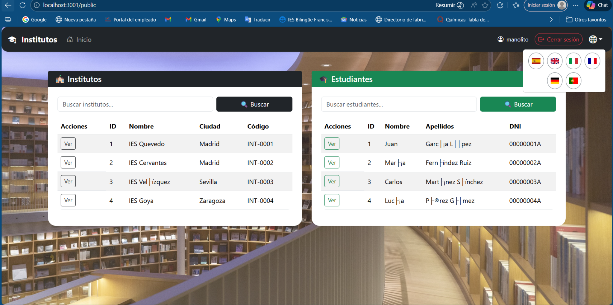

### Captura 2: Usuario con rol ADMIN (vista principal)

En esta captura se accede con un usuario que tiene el rol ADMIN a la vista principal de la aplicación.

Características visibles:

Aparecen los botones Crear instituto y Crear estudiante.

Se muestran las acciones Editar y Eliminar en los listados.

Se confirma que la interfaz se adapta dinámicamente al rol del usuario autenticado.

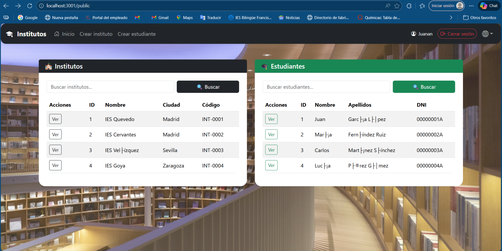

### Captura 3: Usuario con rol ADMIN (vista de detalle)

En esta última captura se muestra la vista de detalle de un estudiante accediendo como ADMIN.

Características visibles:

Se muestran acciones avanzadas como Crear, Editar y Eliminar.

Se comprueba que el control de seguridad en las vistas se mantiene también en pantallas internas, no solo en el listado principal.

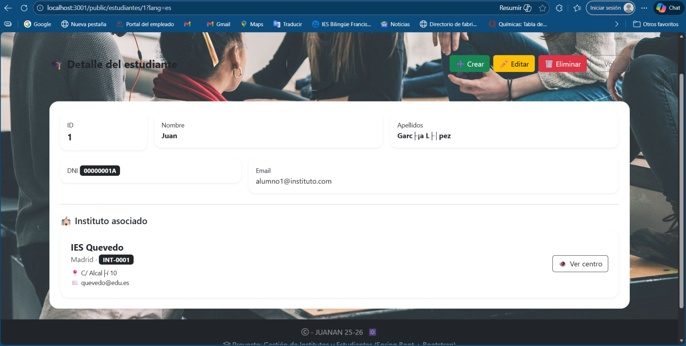

Conclusión

Con esta implementación se garantiza que la interfaz de usuario se adapta al perfil del usuario autenticado, mostrando u ocultando funcionalidades según sus permisos.
Esto refuerza la seguridad de la aplicación y cumple con el requisito solicitado de control de acceso en las vistas mediante Pebble y Spring Security.

### Ejercicio 4: Controlador global para información común en las vistas

En este ejercicio se ha implementado un controlador global mediante @ControllerAdvice para proporcionar información común a la mayoría de las vistas de la aplicación, evitando duplicar lógica en cada controlador individual.

Este controlador global permite que todas las vistas tengan acceso automático a datos relacionados con la sesión del usuario autenticado.

Controlador global (ControllerAdvice)

Se ha creado la clase GlobalControllerAdvice, anotada con @ControllerAdvice, que expone información del usuario autenticado mediante atributos de modelo globales.

En el controlador se obtienen los datos desde el contexto de seguridad de Spring (SecurityContextHolder) y se ponen a disposición de todas las vistas usando @ModelAttribute.

Información proporcionada globalmente:

Nombre del usuario autenticado (loggedUser)

Roles del usuario autenticado (loggedRoles)

De este modo, cualquier vista puede acceder a esta información sin necesidad de que cada controlador la envíe explícitamente al modelo.

Uso de la información global en las vistas

La información proporcionada por el controlador global se utiliza directamente en las plantillas Pebble, especialmente en elementos comunes como el navbar.

### Ejemplo de uso en la vista:

Mostrar el nombre del usuario autenticado en la barra de navegación.

Mostrar u ocultar enlaces según el rol del usuario (por ejemplo, opciones de creación solo para administradores).

Esto permite adaptar la interfaz de forma dinámica según el estado de autenticación y el perfil del usuario.

### Captura 1: Usuario autenticado con rol USER

En esta captura se muestra la barra de navegación accediendo con un usuario con rol USER.

Características visibles:

Se muestra el nombre del usuario autenticado en el navbar.

No aparecen las opciones administrativas como Crear instituto o Crear estudiante.

Se demuestra que la información del usuario se obtiene desde el controlador global.

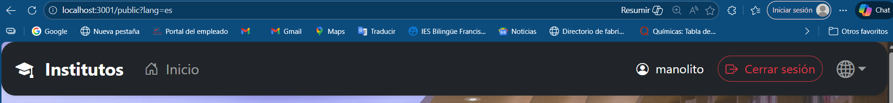

### Captura 2: Usuario autenticado con rol ADMIN

En esta captura se accede con un usuario con rol ADMIN.

Características visibles:

Se muestra el nombre del usuario autenticado en el navbar.

Aparecen las opciones administrativas (Crear instituto y Crear estudiante).

Se confirma que la información global y los roles están disponibles en todas las vistas.

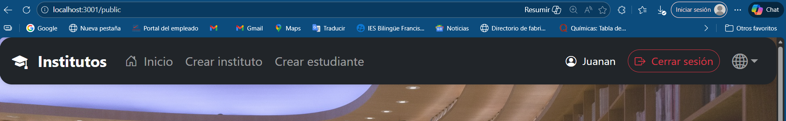

Conclusión

Mediante el uso de un controlador global (@ControllerAdvice) se centraliza la información común de sesión y roles del usuario, facilitando su uso en todas las vistas de la aplicación.

Esta solución mejora la organización del código, evita duplicaciones y cumple con el requisito de proporcionar información común a las vistas de forma global y eficiente.


## Ejercicio 5: Formularios con patrón Post-Redirect-Get y validación de datos

En este ejercicio se han implementado formularios web siguiendo el patrón **Post-Redirect-Get (PRG)**, junto con un primer nivel de **control de validación de datos**, garantizando una correcta experiencia de usuario y evitando problemas derivados del reenvío de formularios.

---

### Patrón Post-Redirect-Get (PRG)

El patrón **Post-Redirect-Get** consiste en:

1. Mostrar un formulario mediante una petición **GET**.
2. Procesar los datos mediante una petición **POST**.
3. Redirigir al usuario a otra vista (**Redirect**) tras procesar correctamente el formulario.

Este patrón evita que el navegador reenvíe los datos al refrescar la página y mejora la estabilidad de la aplicación.

---

### Captura 1: Formulario de creación de instituto (GET)

En esta captura se muestra el formulario para crear un nuevo instituto, accesible mediante una petición GET.

Características:
- URL: `/public/institutos/nuevo`
- Formulario vacío listo para introducir datos.
- Acceso restringido a usuarios con rol ADMIN.

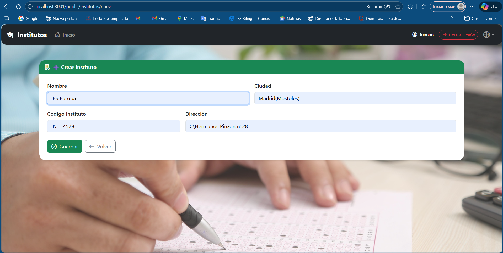

---

### Captura 2: Envío del formulario y redirección (POST → Redirect)

Tras enviar el formulario, los datos se procesan mediante una petición POST y la aplicación redirige automáticamente al usuario a la vista principal.

Características:
- El instituto creado aparece correctamente en el listado.
- La URL ya no es la del formulario.
- Se evita el reenvío del formulario al refrescar la página.

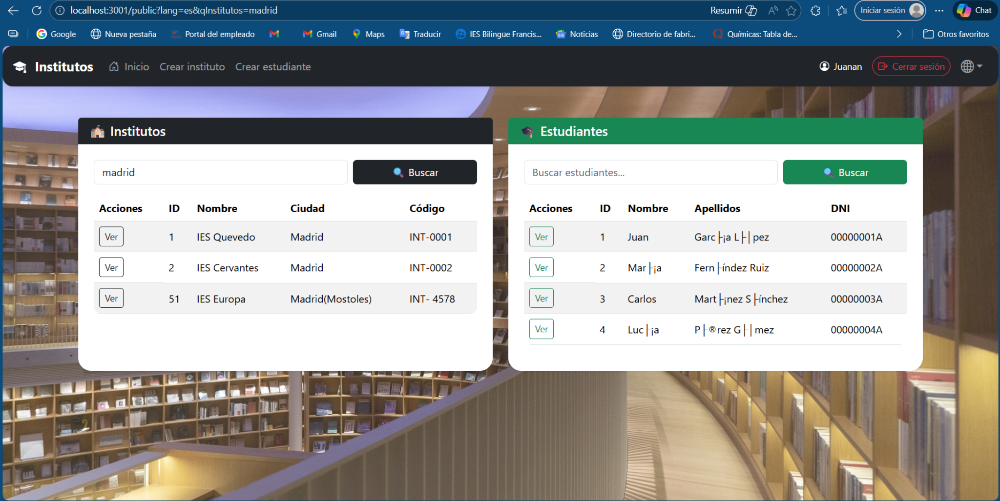

---

### Captura 3: Visualización del detalle del instituto creado

En esta captura se muestra la vista de detalle del instituto recién creado, confirmando que los datos han sido persistidos correctamente en la base de datos.

Características:
- Visualización completa de la información del instituto.
- Acciones disponibles según el rol del usuario.
- Navegación correcta tras el proceso PRG.

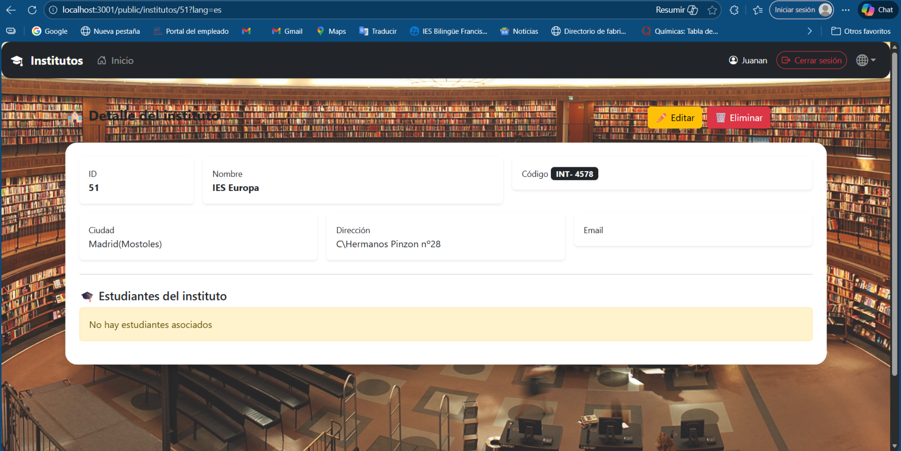

---

### Captura 4: Control de validación por datos duplicados

En esta última captura se muestra el comportamiento de la aplicación al intentar crear un instituto con un **código duplicado**, el cual está protegido por una restricción de unicidad en la base de datos.

Características:
- La base de datos impide la inserción de datos duplicados.
- Se produce un error controlado a nivel de persistencia.
- Se garantiza la integridad de los datos.

Esta validación demuestra que el sistema controla datos incorrectos, aunque como mejora futura se podría mostrar un mensaje de error más amigable al usuario.

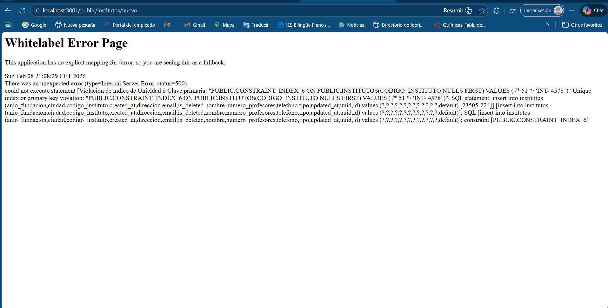

---

### Conclusión

Con esta implementación se cumple el patrón **Post-Redirect-Get**, evitando el reenvío de formularios y asegurando una correcta navegación tras el envío de datos.

Además, se dispone de un control de validación que protege la integridad de la información almacenada, cumpliendo los requisitos solicitados en el ejercicio.

## Ejercicio 6: Uso de sesiones y cookies para gestionar el estado de la aplicación

En este ejercicio se ha implementado la gestión del estado de la aplicación utilizando **sesiones HTTP y cookies**, integradas a través de **Spring Security**.

El objetivo es mantener la información del usuario autenticado disponible entre distintas peticiones y adaptar la interfaz según su estado y rol.

---

### Gestión de sesión de usuario

Cuando un usuario inicia sesión correctamente, Spring Security crea automáticamente una **sesión HTTP**, en la que se almacena:

- El nombre del usuario autenticado.
- Los roles asociados al usuario.
- El estado de autenticación.

Esta información permanece disponible durante toda la navegación hasta que el usuario cierra sesión.

Para facilitar el acceso a estos datos desde todas las vistas, se ha implementado un **controlador global** mediante `@ControllerAdvice`.

---

### Controlador global de sesión

Se ha creado un controlador global que inyecta información común en todas las vistas:

- Usuario autenticado (`loggedUser`)
- Roles del usuario (`loggedRoles`)

java
@ControllerAdvice
public class GlobalControllerAdvice {

    @ModelAttribute("loggedUser")
    public String loggedUser() {
        Authentication auth =
            SecurityContextHolder.getContext().getAuthentication();

        if (auth != null && auth.isAuthenticated()
            && !auth.getPrincipal().equals("anonymousUser")) {
            return auth.getName();
        }
        return null;
    }

    @ModelAttribute("loggedRoles")
    public Collection<? extends GrantedAuthority> loggedRoles() {
        Authentication auth =
            SecurityContextHolder.getContext().getAuthentication();

        if (auth != null && auth.isAuthenticated()
            && !auth.getPrincipal().equals("anonymousUser")) {
            return auth.getAuthorities();
        }
        return null;
    }
}

### Captura: Cookie de sesión (JSESSIONID)

En esta captura se muestra la cookie de sesión `JSESSIONID` generada automáticamente
por Spring Security tras el inicio de sesión del usuario.

La cookie puede verse desde las herramientas de desarrollo del navegador
(Application → Cookies) y es la encargada de identificar la sesión HTTP activa,
permitiendo mantener el estado de autenticación entre peticiones.

Esta cookie se elimina al cerrar sesión o al finalizar la sesión del navegador.
 
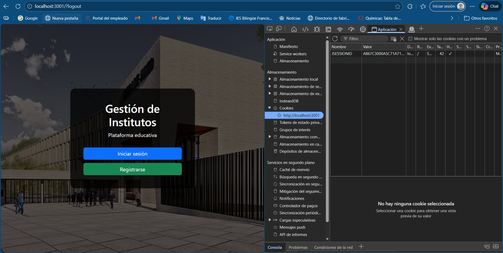

### Gestión del cierre de sesión (Logout)

Además del mantenimiento de la sesión, la aplicación implementa correctamente el cierre de sesión (logout) utilizando Spring Security.

Cuando el usuario pulsa la opción de cerrar sesión:

La sesión HTTP se invalida correctamente.

La cookie de sesión JSESSIONID deja de ser válida.

El usuario es redirigido automáticamente a la pantalla inicial de la aplicación.

Se evita cualquier acceso posterior sin volver a autenticarse.

Este comportamiento garantiza que no se mantiene información sensible tras el cierre de sesión.

Evidencia del cierre de sesión

En la siguiente captura se puede observar el proceso completo de cierre de sesión:

Registro del evento LOGOUT en la consola del servidor.

Identificación del usuario que ha cerrado sesión.

Contador de cierres de sesión, confirmando que la acción se ha ejecutado correctamente.

Redirección a la pantalla principal con las opciones Iniciar sesión y Registrarse visibles.

Con esta implementación se demuestra:

El uso correcto de sesiones HTTP para mantener el estado del usuario.

La gestión automática de cookies mediante JSESSIONID.

La invalidación segura de la sesión al cerrar sesión.

La correcta redirección del usuario tras el logout.

De este modo, la aplicación gestiona de forma adecuada el estado de autenticación del usuario, cumpliendo el requisito solicitado de uso de sesiones y cookies mediante Spring Security.

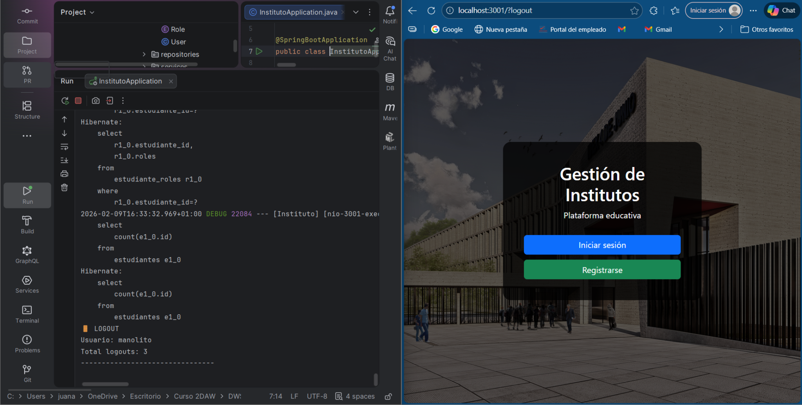


